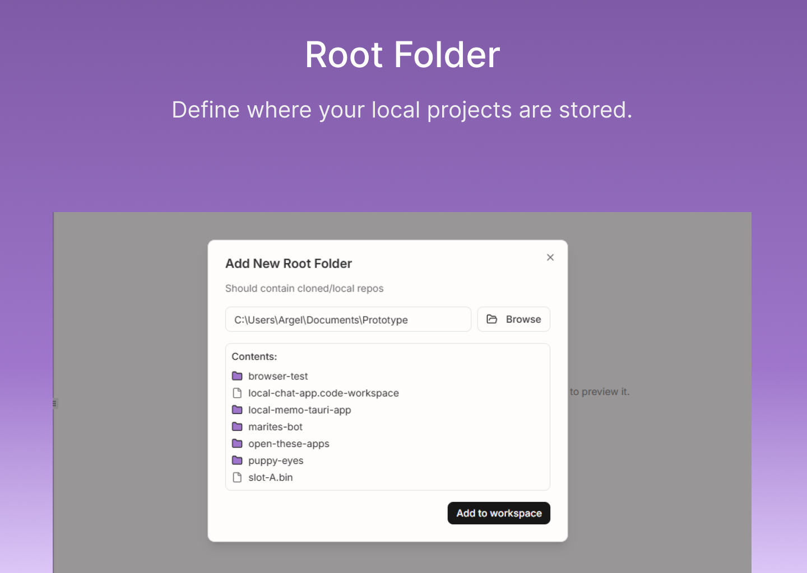
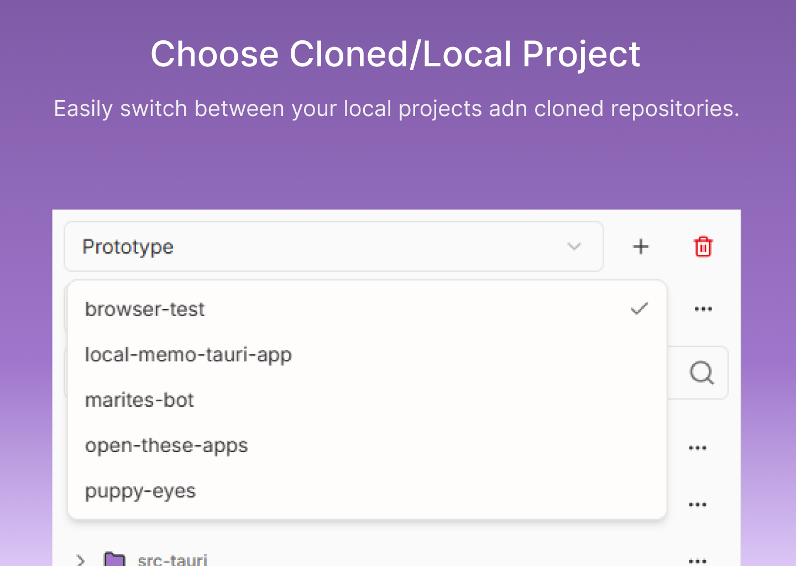
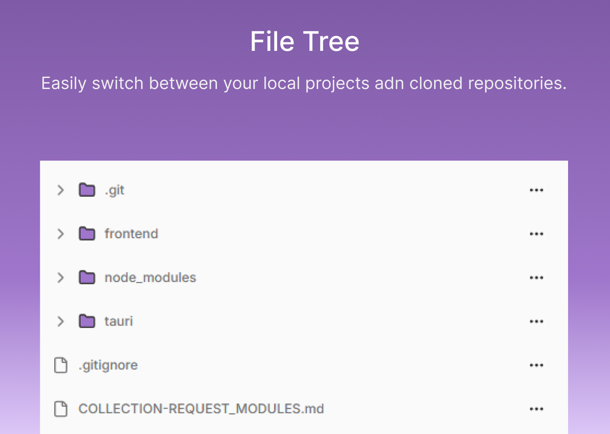
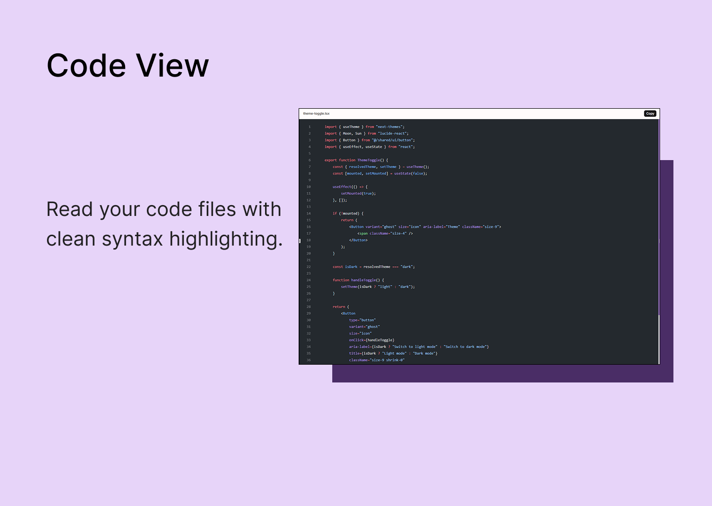
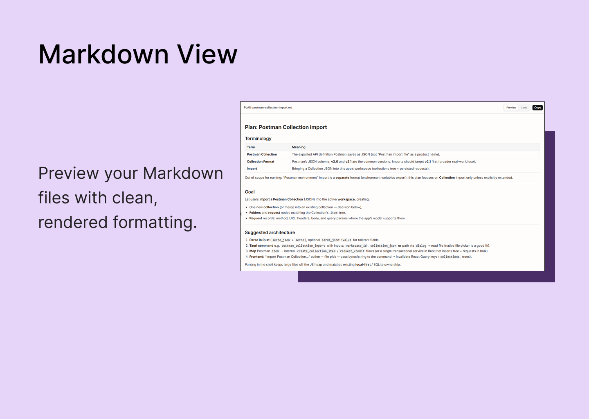

# Local Code Archive

**Less friction when exploring your repos**

A local-first desktop app for opening folders and cloned repositories, browsing the file tree, and previewing source and text files. Nothing leaves your machine unless you copy or share it yourself. No account, no cloud, no lock-in.

---

## Description

Local Code Archive is a desktop application for developers who want a fast, minimal way to **navigate** and **read** code on disk. Add one or more **workspace roots** (for example a parent folder that contains several clones), pick a **repository** under that root, then walk the **folder tree** and open files in the preview pane.

Supported previews include **Markdown** (rendered preview or raw), **syntax-highlighted code** and plain text for common extensions, and a simple view for **binary assets** where previewing makes sense. You can **copy** file contents or paths from the viewer. The shell can **reveal** the current path in your system file manager when you need to jump out to another tool.

The UI includes **light and dark** themes for comfortable reading. The app is built with [Tauri](https://tauri.app) and [React](https://react.dev), with workspace metadata stored locally (for example in **SQLite**) so your roots and layout preferences persist between sessions.

---

## Features

| Feature                    | Description                                                                                                      |
| -------------------------- | ---------------------------------------------------------------------------------------------------------------- |
| **Workspace roots**        | Register local directories (for example a `projects` folder) and switch between them.                            |
| **Repository picker**      | Choose which repo under the active root you are browsing.                                                        |
| **File tree**              | Expandable tree with loading from disk; optional search to filter the tree while you work.                       |
| **File preview**           | Open a file to see Markdown (preview or code), highlighted code/text, or an asset-oriented view when applicable. |
| **Copy**                   | Copy the file body from the preview toolbar.                                                                     |
| **Reveal in file manager** | Open the current location in the OS file explorer where supported.                                               |
| **Theme**                  | Built-in light/dark modes.                                                                                       |
| **Local-first**            | Trees and file reads happen on your device; workspace records stay local.                                        |

---

## Screenshots

  

  

  

  

  

---

## What’s New

- Workspace root creation, listing, and removal
- Per-root repository discovery and selection
- Directory tree loading and file selection
- Preview pane for Markdown, code/text, and supported assets
- Local persistence for workspace configuration
- Light/dark theme support

---

## Requirements

- **OS:** Windows
- **Disk:** Minimal; workspace metadata and app data are stored locally alongside your existing repos
- **Network:** Not required for browsing local files; optional only if you use features that touch the network in the future

---

## Privacy & Data

- **No account required.** No sign-up, no email, no cloud account.
- **Paths and file contents stay on your device** unless you export, screenshot, or copy them elsewhere.
- **No telemetry by default.** The app is oriented around local filesystem access and does not upload your repository contents as part of core browsing.

---

## Technical Details

|                |                                                                                 |
| -------------- | ------------------------------------------------------------------------------- |
| **Built with** | Tauri (Rust), SQLite, React Router 7, React Query, Tailwind CSS, Radix-based UI |
| **License**    | MIT                                                                             |
| **Source**     | See your repository hosting page for the canonical URL                          |

---

## Get Local Code Archive

Soon
