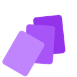
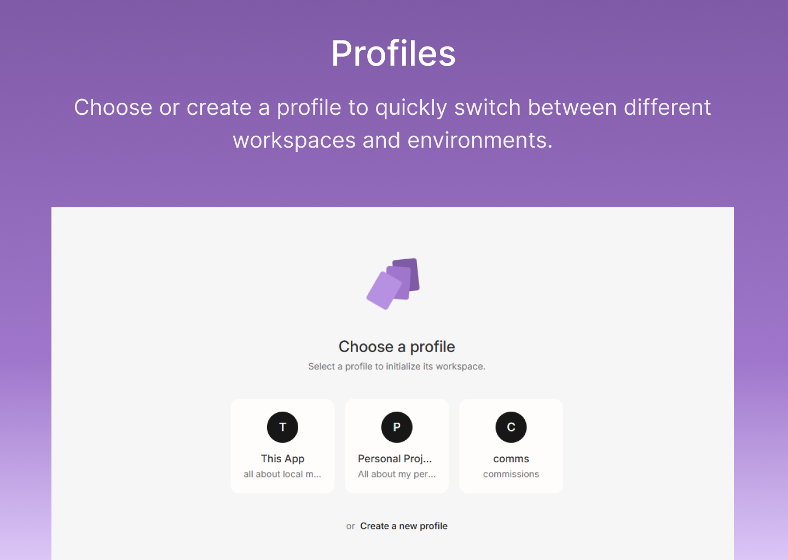
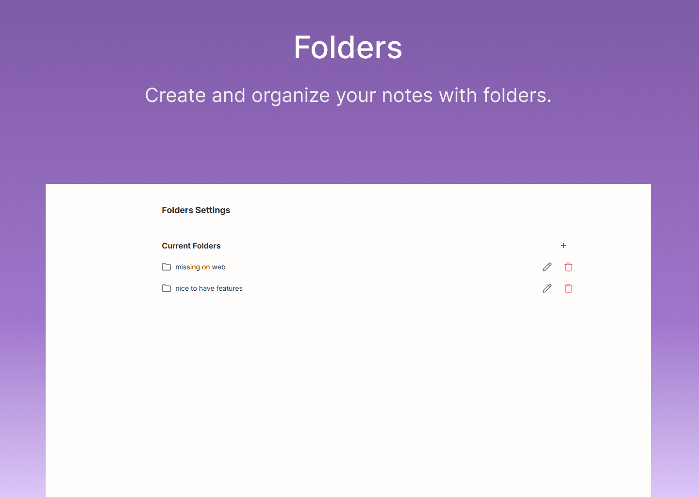
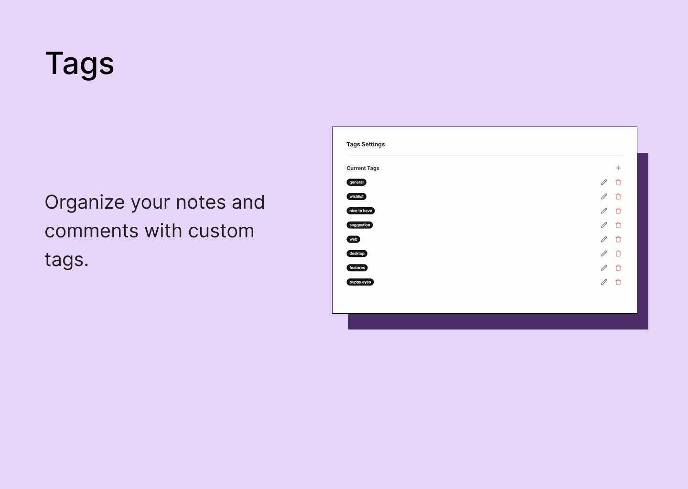
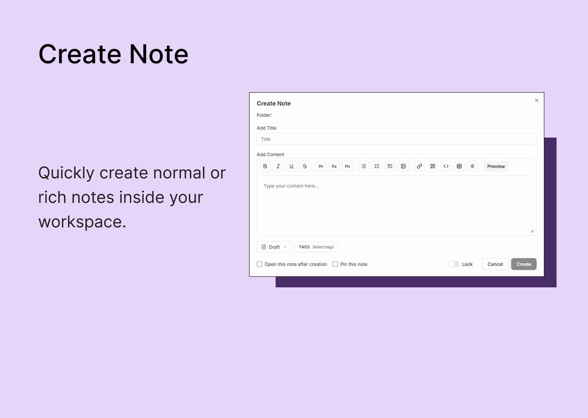
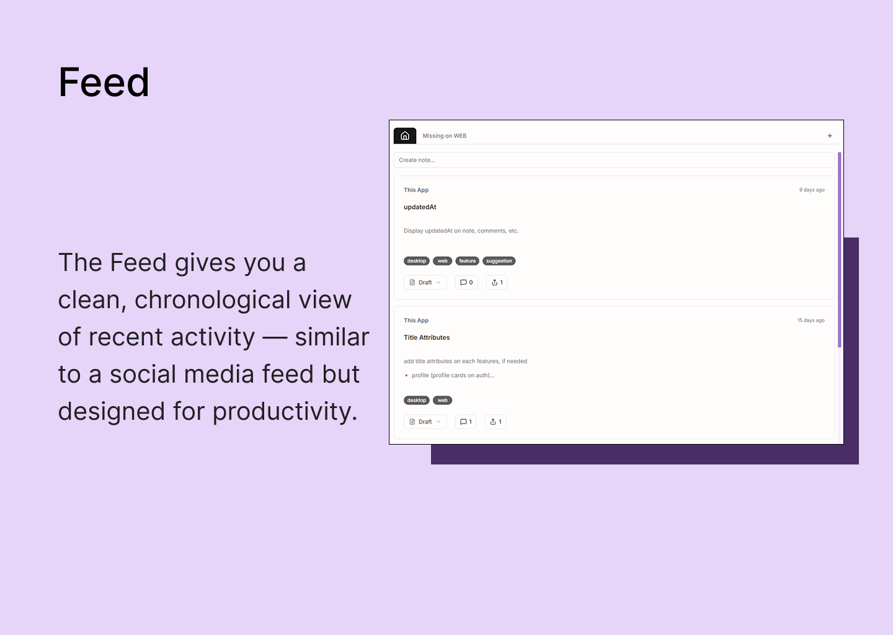
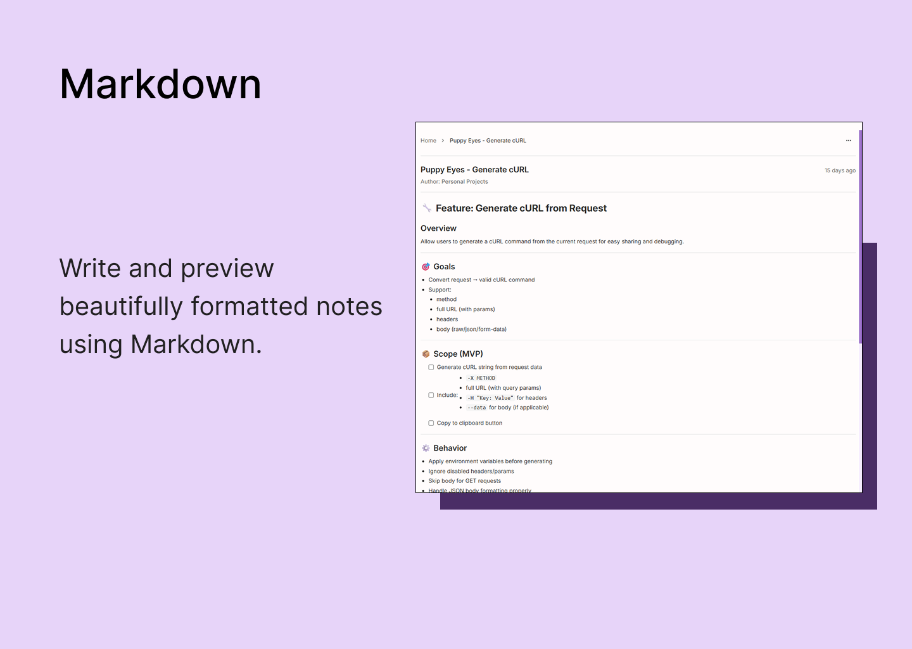
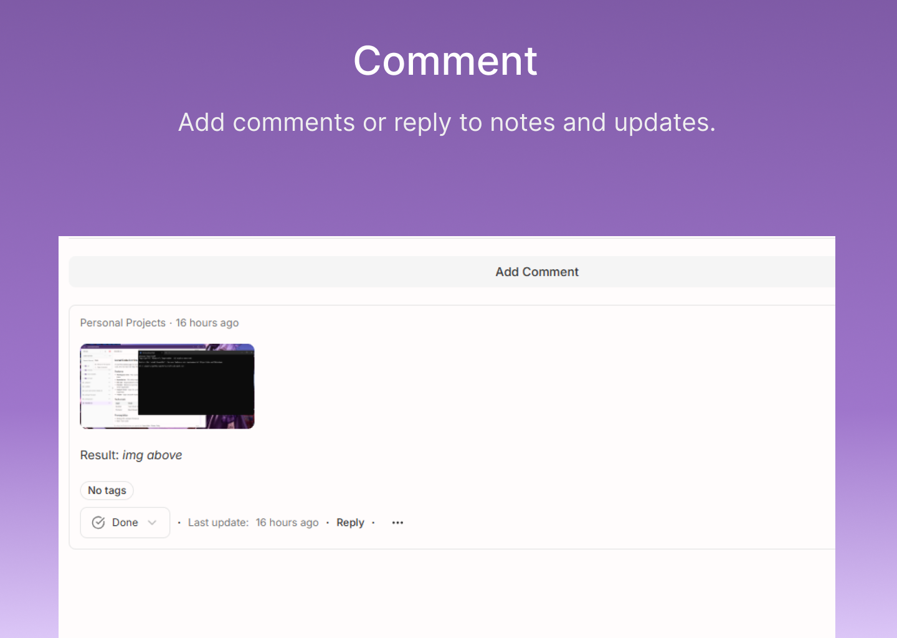

# Local Memo

**Your notes, on your machine.**

A local-first desktop notes app. Organize memos in profiles and folders, add comments and tags, attach images—all stored on your computer. No account, no cloud, no lock-in.

---

## Description

Local Memo is a desktop application built for people who want full control of their notes. Everything lives in a local SQLite database. Switch between **profiles** for different contexts (work, personal, projects), organize notes in **folders**, and use **tags** and filters to find what you need. Write in **Markdown**, attach images, and discuss ideas with **threaded comments**—right inside each note.

Light and dark themes are included, with an optional schedule (e.g. dark mode at night). The app is built with [Tauri](https://tauri.app) and [React](https://react.dev), so it stays fast and lean.

---

## Features

| Feature         | Description                                                                                                                                                                      |
| --------------- | -------------------------------------------------------------------------------------------------------------------------------------------------------------------------------- |
| **Profiles**    | Separate workspaces (e.g. work, personal). Each profile has its own notes, folders, and tags.                                                                                    |
| **Folders**     | Organize notes in folders.                                                                                                                                                       |
| **Notes**       | Create, edit, pin, archive, and share _with your other profiles_ (on this device only—not social or link sharing). Markdown content and image attachments. Soft and hard delete. |
| **Comments**    | Threaded comments on notes, with optional attachments.                                                                                                                           |
| **Tags**        | Per-profile tags. Filter notes by tag, status, date, or search.                                                                                                                  |
| **Theme**       | Light/dark mode with optional schedule (e.g. dark at night).                                                                                                                     |
| **Local-first** | Data stays on your device. No account or server required.                                                                                                                        |

---

## Screenshots

  

  

  

  

  

  

  

---

## What’s New

- Profiles, folders, notes with Markdown and image attachments
- Threaded comments on notes
- Tags and filters (tag, status, date, search)
- Pin, archive, share notes with your other local profiles (same device only), and delete (soft/hard)
- Light/dark theme with optional schedule
- Local-first; all data stored in SQLite on your machine

---

## Requirements

- **OS:** Windows
- **Disk:** Minimal; app and data are stored locally
- **Network:** Not required for core usage (optional if you add sync later)

---

## Privacy & Data

- **No account required.** No sign-up, no email, no cloud account.
- **Data stays on your device.** Notes, comments, and attachments are stored in a local SQLite database.
- **No telemetry by default.** The app runs offline and does not send your content anywhere. “Share” in the app only makes a note visible to your _other profiles_ on this device—no links, no social sharing, no cloud.

---

## Technical Details

|                |                                                                                    |
| -------------- | ---------------------------------------------------------------------------------- |
| **Built with** | Tauri (Rust), SQLite, React Router 7, React Query, Tailwind CSS, Shadcn (Radix UI) |
| **License**    | MIT                                                                                |
| **Source**     | [GitHub](https://github.com/your-username/local-memo-desktop)                      |

---

## Get Local Memo

Soon
