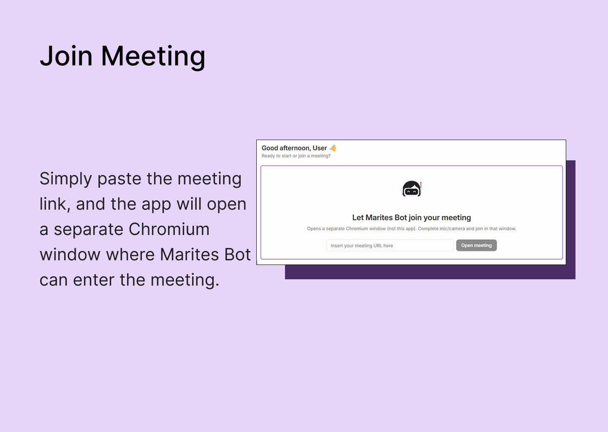
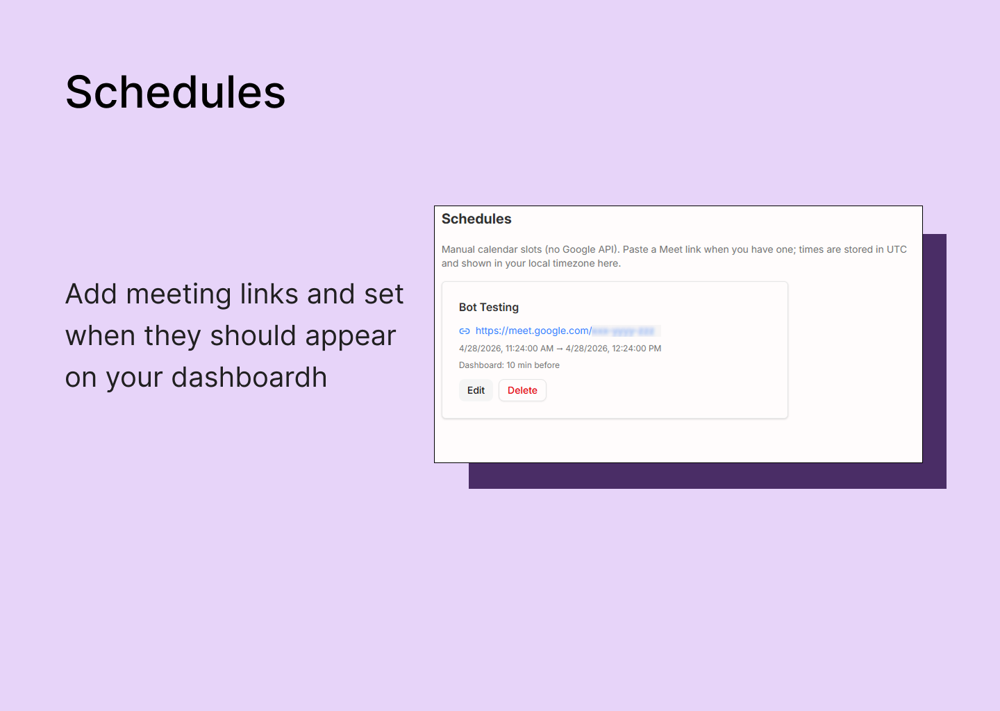
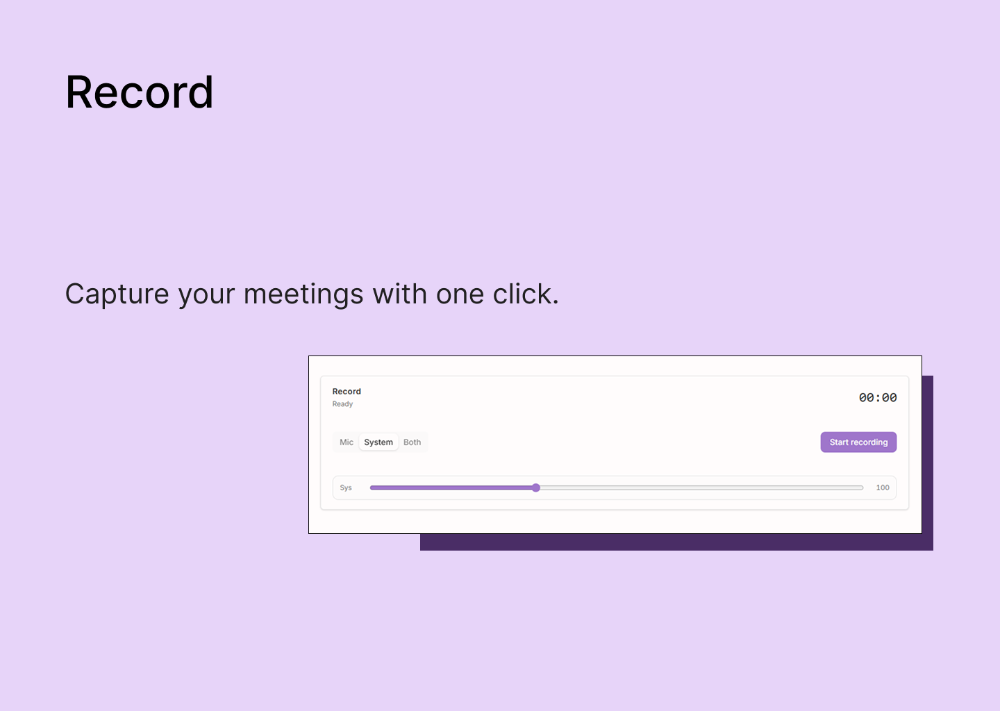
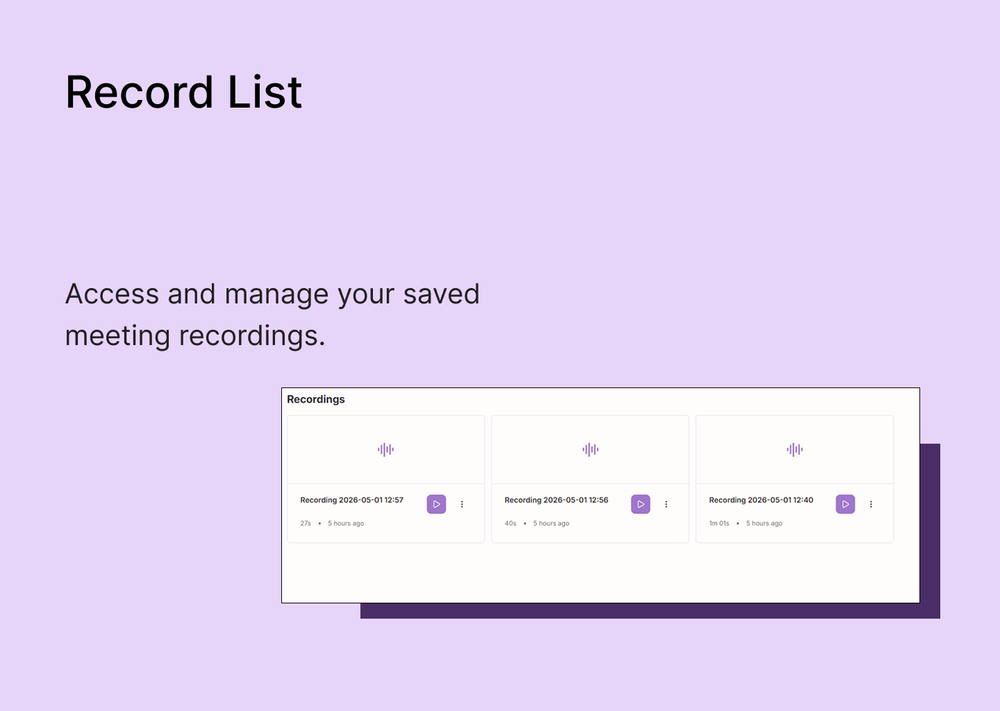
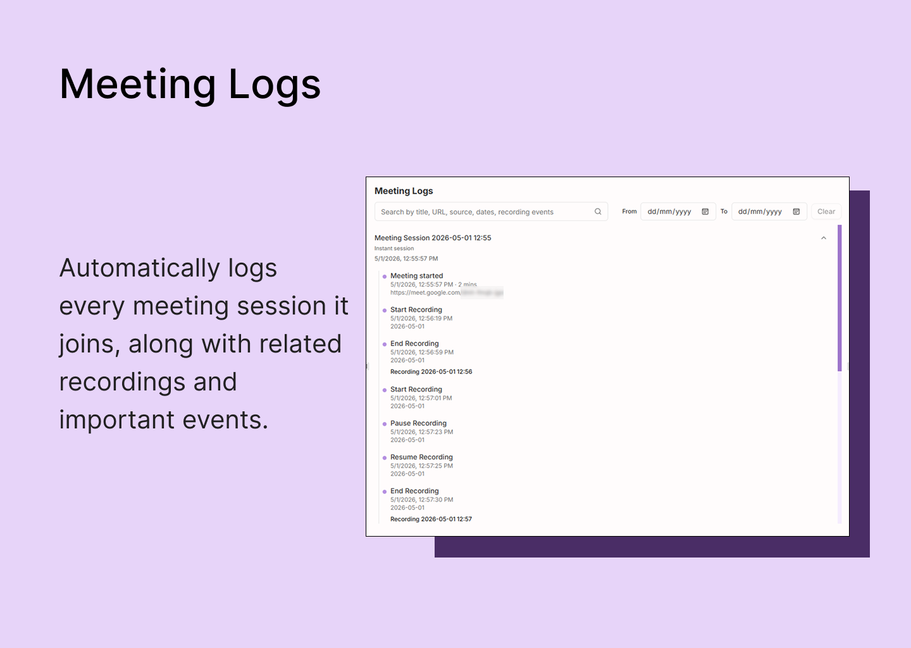
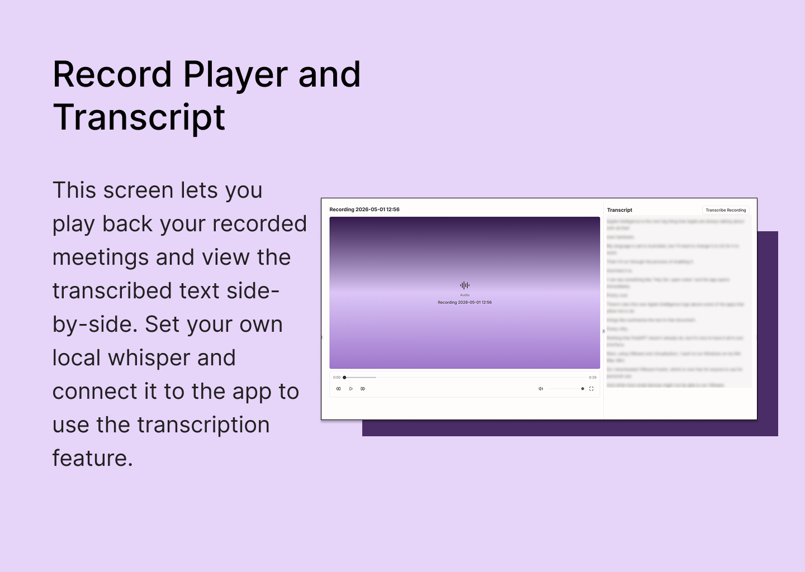

# Marites Bot

**Local-first audio recorder**, with an **optional meeting bot** for transparent, consent-minded calls.

## What it is

**Recording is the core.** Capture **microphone**, **system** sound, or **both** on Windows where that mode is implemented. Save **WAV**, pause and resume, adjust levels, then browse and play clips in the library. Optional **Whisper CLI** transcription: you install Whisper, point the app at your binary and model in Settings, and generate **.txt** files locally. No meeting URL or browser join is required to record.

**The meeting bot is optional.** Paste a supported **video meeting link** (Google Meet and Zoom manually tested; browser-based Teams and similar URLs may work too). Marites opens a **separate window**—not your everyday Chrome or Edge—with that link so **Marites can appear as its own attendee** in the waiting room until the host admits it. Everyone can see there is an extra participant; polite use means agreeing with attendees and respecting host rules—that’s on you; the app does **not** auto-post disclaimers or drive chat.

**Recording without the bot** still creates WAV files and **Recordings** entries. You only get **session-style meeting logs** tied to recordings when **both** the meeting bot is in a session **and** you record from the app.

Data lives in SQLite and folders under your profile; core flows don’t rely on the vendor’s cloud.

---

## Description

Marites separates **your controls** (the main window: recorder, schedules, playback, settings) from **presence in the call** (the extra window loading the URL). Meeting join uses a **fresh browser profile each run** in the shipping UI unless a persistent “meeting bot only” login folder is exposed later once it’s validated.

The UI includes a **dashboard** (recorder + optional join + schedules + stats + recent activity), **recordings** (list, player, transcript actions), **schedules**, **meeting logs**, **Settings** (including Whisper paths), and **themes** with optional scheduled night mode.

---

## Features

| Feature                     | What you get                                                                                                                                                                                                                                         |
| --------------------------- | ---------------------------------------------------------------------------------------------------------------------------------------------------------------------------------------------------------------------------------------------------- |
| **Audio recording**         | Mic, system, or both where supported; pause/resume; gain; WAV on disk plus entries in the app. Works with zero meeting features.                                                                                                                     |
| **Optional meeting bot**    | Checks meeting web links, launches a dedicated window with that link as a visible join; start/stop and status from the dashboard. Separate from Marites and your default browser; only opens the URL and keeps the session—no scripted chat consent. |
| **Meeting activity logs**   | Structured timeline while a bot session runs and you record; plain recording-only runs skip meeting-linked timeline rows—files still show under Recordings.                                                                                          |
| **Recordings library**      | List, in-app playback, open externally, reveal in explorer, delete.                                                                                                                                                                                  |
| **Transcription (Whisper)** | Whisper CLI path + model path in Settings; run transcribe from the player; `.txt` under app data when done.                                                                                                                                          |
| **Schedules**               | Titles, optional URL, times, reminders; **Join now** starts the meeting bot for the schedule you picked.                                                                                                                                             |
| **Dashboard stats**         | Such as joins opened, recording count, total recording time, rough storage estimate for WAVs.                                                                                                                                                        |
| **Persistence**             | SQLite plus **recordings** and **transcripts** folders—default root `Documents/Local Apps/Marites Bot`, or override with **`MARITES_BOT_DB_DIR`**.                                                                                                   |
| **Theme**                   | Light/dark and optional schedule (e.g. dark at night).                                                                                                                                                                                               |
| **Local-first**             | No account or hosted backend for core recording, library, schedules, or local Whisper runs.                                                                                                                                                          |

---

## Screenshots

  

  

  

  

  

  

---

## What’s new

- **Recorder-first:** system/mic/both without any meeting join.
- Optional **separate browser window** for meeting URLs; persistent login folder for that window may ship in the UI after validation.
- **Multi-source WAV** with pause/resume and level controls; mixed mic+system path on Windows.
- **SQLite** for schedules, recordings metadata, and session logs when the meeting bot is active.
- **Whisper CLI** wiring for offline transcripts.
- Single-page UI with toasts and a resizable dashboard.

---

## Requirements

- **OS:** Built around **Windows** for system-capture modes; macOS/Linux need more work.
- **Runtime:** **Node.js** and a packaged browser driver **only if** you use the meeting bot (install step in the app/project docs).
- **Transcription:** A **Whisper-compatible CLI** and model file; paths in **Settings**.
- **Network:** Only for loading the meeting URL in the bot window, not for saving local files or Whisper.

---

## Privacy and data

- No cloud account or vendor API for core recording, library, schedules, or local Whisper transcription.
- Paths and audio stay on your machine unless you copy or upload them.
- A future **saved login** for the meeting-only window would be a folder under app data—not your main browser profile.
- **Telemetry:** none in the flows described here; the meeting site and Whisper follow their own policies.

---

## Technical details

|                 |                                                                                                                       |
| --------------- | --------------------------------------------------------------------------------------------------------------------- |
| **Shell**       | Tauri 2 (Rust), Vite, React 19                                                                                        |
| **UI**          | React Router 7, TanStack Query, Tailwind CSS 4, component library–style UI, toasts, theme switching, resizable panels |
| **Backend**     | SQLite, audio capture and WAV encoding in Rust; Windows loopback where used                                           |
| **Meeting bot** | Small Node helper that opens the URL in an automated Chromium build (generic URLs; Meet, Zoom manually tested)        |
| **License**     | MIT (see `LICENSE`)                                                                                                   |
| **Source**      | https://github.com/MarkMalihan/marites-bot                                                                            |

---

## Get Marites Bot

Soon
