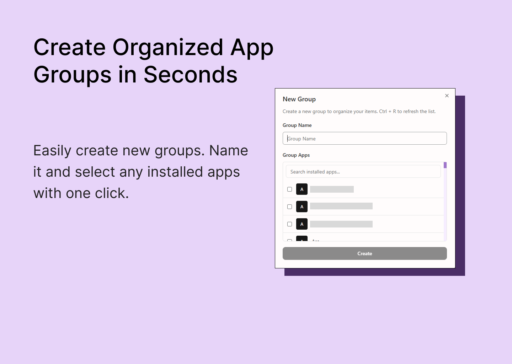
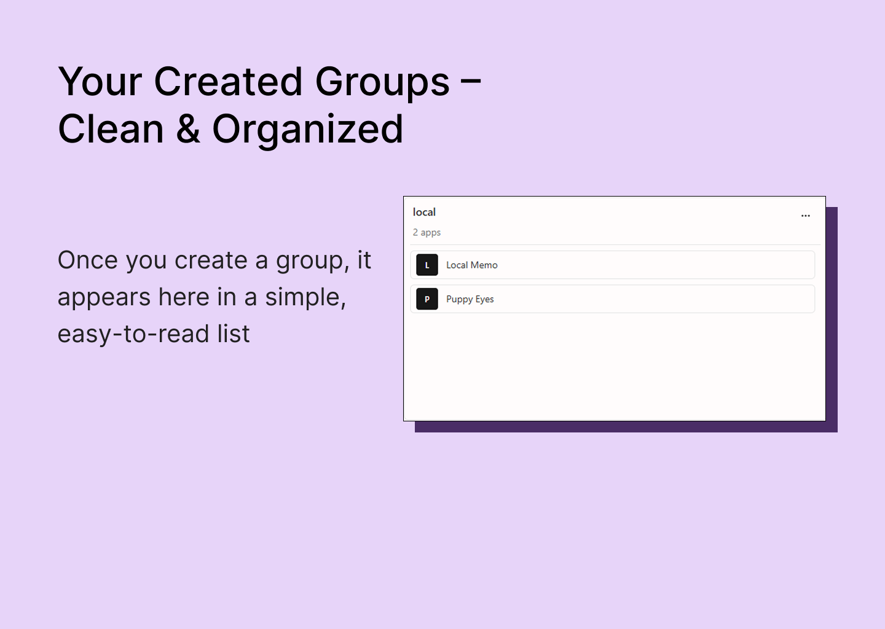
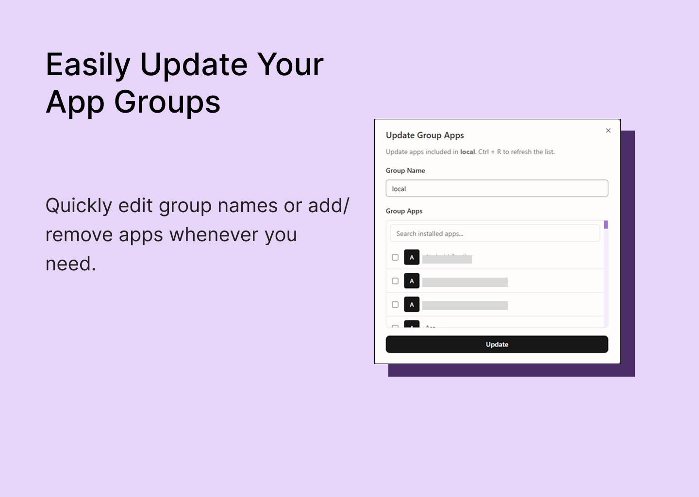
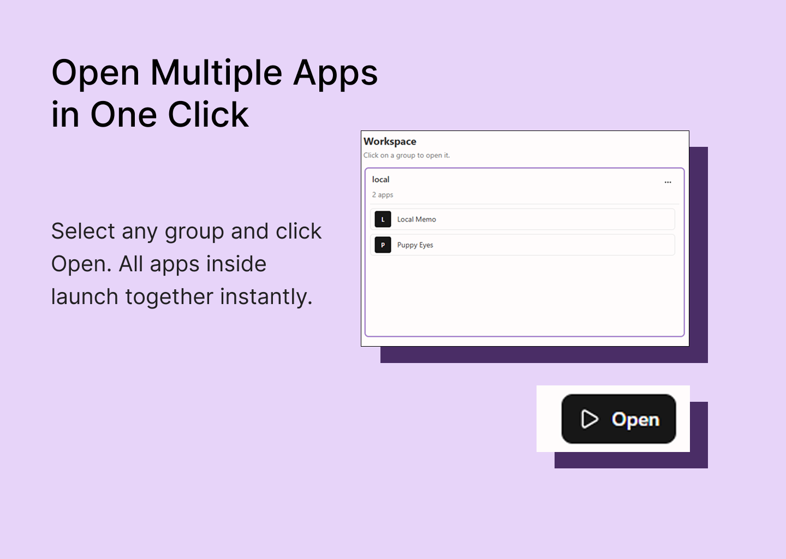

# Open These Apps

**Launch your app sets in one click.**

A local-first desktop launcher for organizing installed applications into reusable groups. Build a group (for example "Work", "Content", or "Dev"), then open everything in that group at once.

---

## Description

Open These Apps helps you save startup time by turning repeated app-opening routines into one action. It reads your installed apps list (with local permission), lets you pick apps for each group, stores those groups locally, and launches them together when you hit Open.

The app is built with [Tauri](https://tauri.app) and [React](https://react.dev), with a Rust backend for OS integration and SQLite for local persistence.

---

## Features

| Feature                   | Description                                                                     |
| ------------------------- | ------------------------------------------------------------------------------- |
| **Group Workspaces**      | Create, select, update, and delete named groups of installed apps.              |
| **Installed Apps Picker** | Pull apps from your system and add them to a group quickly.                     |
| **One-click Launch**      | Open all apps in the selected group in one run action.                          |
| **App Initials**          | Shows initials-based avatars for each app for a consistent lightweight UI.      |
| **Permission Gate**       | Explicit local consent before reading installed apps (stored with a 3-day TTL). |
| **Local-first Storage**   | Group and item data are saved in local SQLite, not cloud services.              |
| **Light/Dark Theme**      | Built-in theme support for comfortable day and night usage.                     |

---

## Screenshots

  

  

  

  

---

## What's New

- Group creation, update, and deletion flows
- Installed apps selection and initials-based app avatars
- Batch app opening from selected group
- Legal acceptance gate (Terms and Privacy)
- Auto-start integration (where supported by platform)
- Improved local-first desktop UI with light/dark themes

---

## Requirements

- **OS:** Windows is currently the fully supported platform for installed-app listing and app launching
- **Disk:** Minimal; local database only
- **Network:** Not required for core usage (except downloading/installing the app itself)

---

## Privacy & Data

- **No account required.** No sign-up, no cloud identity, no sync requirement.
- **Data stays local.** Groups and selected apps are stored on your device.
- **Local permission flow.** Installed-app access is explicitly requested in-app.
- **No forced telemetry.** The app is designed for local use without mandatory tracking.

---

## Technical Details

|                |                                                                                                       |
| -------------- | ----------------------------------------------------------------------------------------------------- |
| **Built with** | Tauri 2 (Rust), React 19, TypeScript, SQLite, React Query, Tailwind CSS, Shadcn (Radix UI primitives) |
| **License**    | MIT                                                                                                   |
| **Source**     | [GitHub](https://github.com/your-username/open-these-apps)                                            |

---

## Get Open These Apps

Soon
