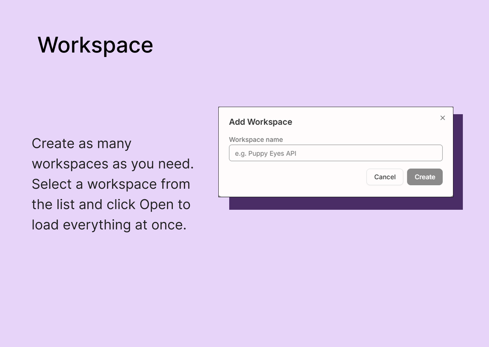
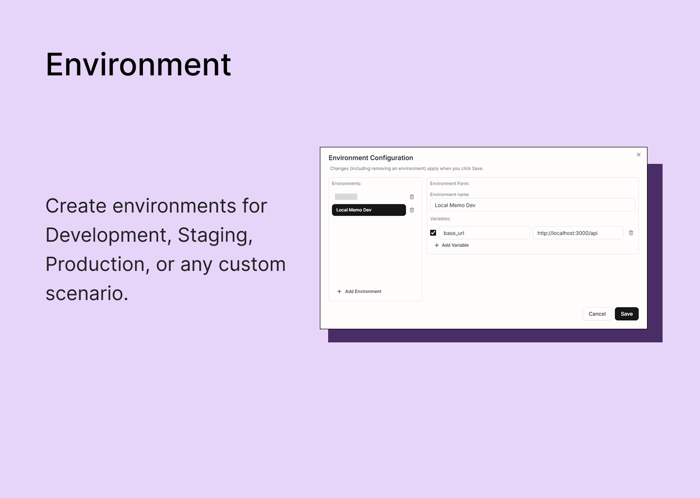
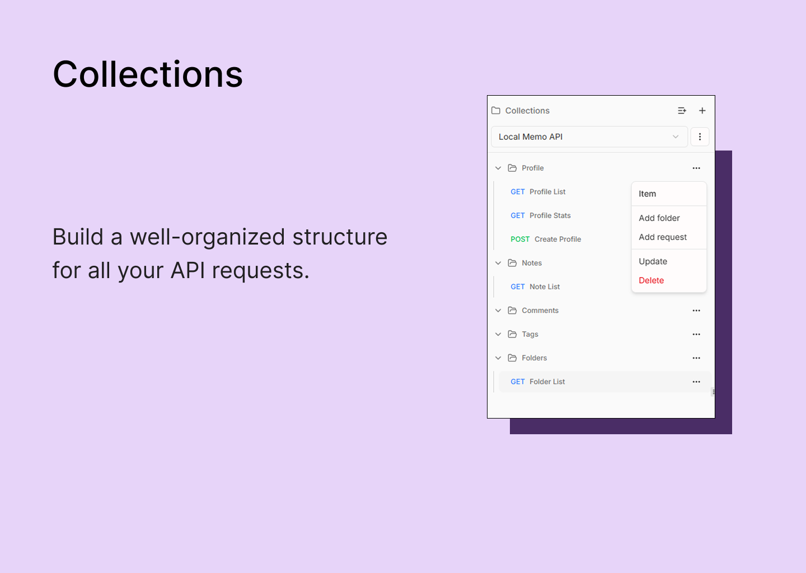
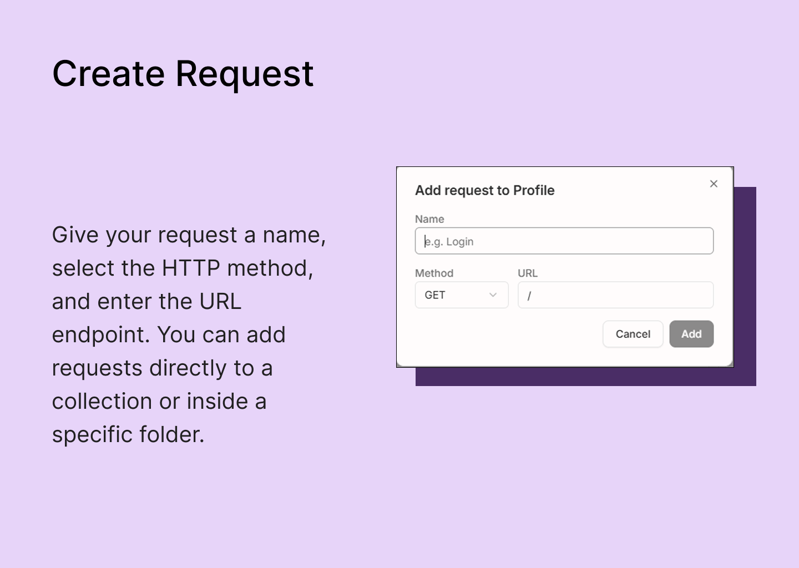
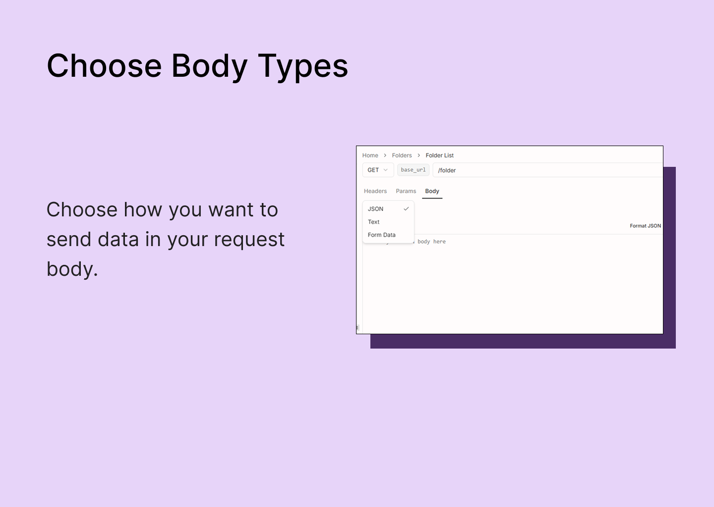
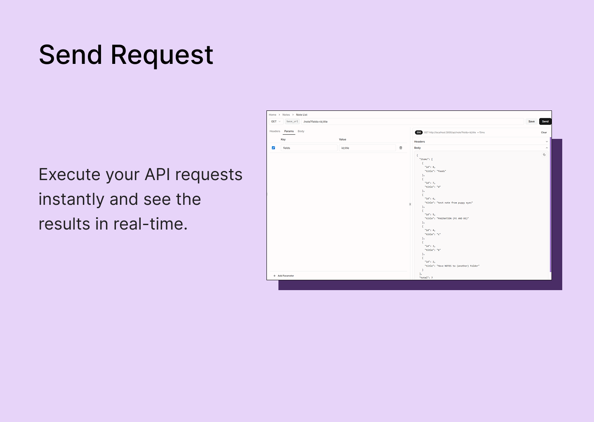

# Puppy Eyes

**Your API workflows, on your machine.**

A local-first desktop API client. Organize requests in workspaces and collections, configure environments, edit request data, and inspect responses. Everything stays on your machine. No account, no cloud, no lock-in.

---

## Description

Puppy Eyes is a desktop application built for developers who want full control over their API workflow. Create and switch **workspaces**, organize endpoints in **collections/folders**, and define **environments** for different targets like local, staging, and production. Compose requests with method, URL, params, headers, and body (JSON/text/form-data), then inspect status, headers, and body in a structured response viewer.

Light and dark themes are included for comfortable day/night usage. The app is built with [Tauri](https://tauri.app) and [React](https://react.dev), so it stays fast and lightweight.

---

## Features

| Feature             | Description                                                                             |
| ------------------- | --------------------------------------------------------------------------------------- |
| **Workspaces**      | Separate API contexts by project/team and switch between them quickly.                  |
| **Collections**     | Organize requests in folder trees for cleaner endpoint grouping.                        |
| **Request Editor**  | Build requests with method, URL, query params, headers, and body (JSON/text/form-data). |
| **Environments**    | Store variables and inject placeholders (for example `{{BASE_URL}}`) at send time.      |
| **Response Viewer** | View status code, response headers, and formatted body after execution.                 |
| **Theme**           | Built-in light/dark modes for long API testing sessions.                                |
| **Local-first**     | Data and configuration stay on your device; no cloud account required.                  |

---

## Screenshots

  

  

  

  

  

  

---

## What’s New

- Workspace creation and switching
- Collection/folder tree management
- Request editor for URL, method, params, headers, and body
- Environment variable configuration and placeholder substitution
- Response panel with status, headers, and body formatting
- Light/dark theme support for desktop usage

---

## Requirements

- **OS:** Windows, macOS, or Linux (Tauri builds for your platform)
- **Disk:** Minimal; app configuration and data are stored locally
- **Network:** Required only when sending API requests

---

## Privacy & Data

- **No account required.** No sign-up, no email, no cloud account.
- **Data stays on your device.** Workspaces, collections, environments, and request metadata are stored locally.
- **No telemetry by default.** The app does not upload your saved project data to external servers.

---

## Technical Details

|                |                                                                                    |
| -------------- | ---------------------------------------------------------------------------------- |
| **Built with** | Tauri (Rust), SQLite, React Router 7, React Query, Tailwind CSS, Shadcn (Radix UI) |
| **License**    | MIT                                                                                |
| **Source**     | [GitHub](https://github.com/your-username/puppy-eyes-desktop)                      |

---

## Get Puppy Eyes

Soon
